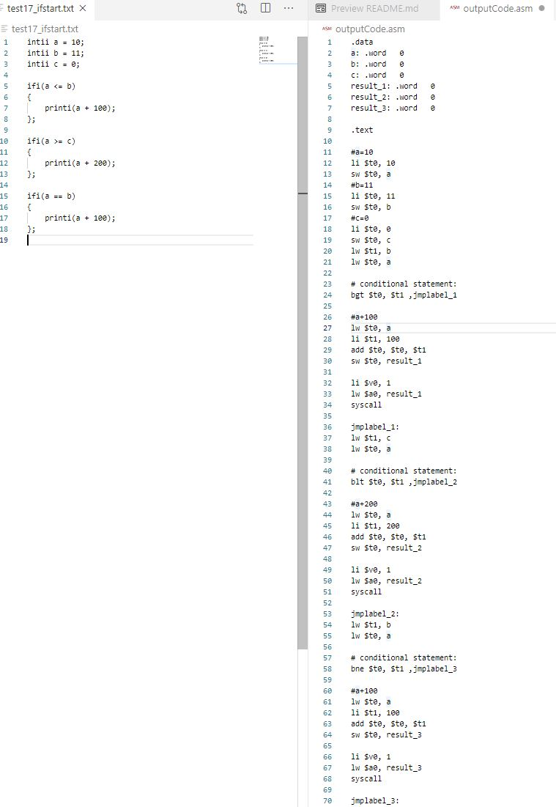

# Goodii Language Specification

Note: Project is unfinished. Version 1.0 includes only possibility to:
* declare variables (e.g intii a;)
* assignment of intii and dublii values, (intii a = 5; dublii b = 5.0;)
* arithmetic: multiplication, substraction, addition, division (intii a = 5 + 5; intii b = 5 + 10; intii c = a + b)
* compilation errors when intii and dublii are used in a single statement (e.g intii a = 5; dublii b = 10.0; intii c = a + b; // compilation error!
* printing value of intii and dublii to the otput stream (e.g printii(a); printii(5); printi(55.0);
* reading value from input stream (e.g intii a; ridi(a);)
* if statement - without else (e.g intii a = 5; intii b = 10; ifi(a => b) { //some action };

(the whole specification is possibly for the future versions)

# Goodii code generated to .asm

 

## **Goodii Types**

| Name | Description |
| --- | --- |
| **intii** | 32-bit signed integer |
| **dublii** | 64-bit double precision floating point type |
| **stringii** | .. |
| **boolii** | Boolean value |

## **Goodii Loops**

| name | description |
| --- | --- |
| **whilii(_ condition _){ _//block of code_ }** | whilii can execute a block of code as long as condition is true. |

## **Goodii Decision making**

| name | description |
| --- | --- |
| **ifii** | Identifies if statement should be run. |
| **ifii( __condition__){ ****}**** elsii ****{**** }** | Identifies which statement to run based on value of condition |

## **Goodii Relational operators**

| operator | description |
| --- | --- |
| > | Checks if the value of left operand is greater than value of right operand |
| < | Checks if the value of left operand is less than value of right operand |
| >= | Checks if the value of left operand is greater than or equal value of right operand |
| <= | Checks if the value of left operand is less than or equal value of right operand |

## **Goodii Arithmetic operators**

| operator | description |
| --- | --- |
| * | Multiplies both operands |
| /\ | Divides numerator by de-numerator |
| - | Substract second operand from the first |
| + | Adds two operands |
| == | Checks if two operands are equal. |
| != | Checks if two operands are not equal |
| = | Assignment operator |
| ++ | Increment operator increases integer value by one |
| -- | Decrement operator decreases integer value by one |

## ~~**Goodii Logical operators (not supported)**~~

| ~~!~~ | ~~Logical NOT operator.~~ |
| --- | --- |
| ~~&amp;&amp;~~ | ~~Logical AND operator.~~ |
| ~~||~~ | ~~Logical OR operator.~~ |

##

## **Goodii keywords / literals**
| name | description |
| --- | --- |
| **returnii** | Finishes the execution. |

## **Goodii literals**

| name | description |
| --- | --- |
| **goodii** | Means that is true |
| **badii** | Means that it is false |
| **nullii** | Null reference, doesn&#39;t refer to any object. |

## **Goodii Other lexems**

| **Escape sequence** | **Meaning** |
| --- | --- |
| ( | Left bracket |
| ) | Left brace |
| [ | Right bracket |
| ] | Right Bracket |
| ; | End of expression |
| \t | New tab |
| \n | New Line |
| // | Comment |

## **Goodii Arrays**

Declaration of arrays with length = 5.

**intiiGoodies[5]** arrayOfInts;

**dubliGoodies[5]** arrayOfDoubles;

**stringiGoodies[5]** arrayOfStrings;

## Goodii Input/Output
| name | description |
| --- | --- |
| **Printi (value**) | Printing **identifier** value to output stream. |
| **Printi (5)** | Printing **intii** value to output stream. |
| **Printi (55.0)** | Printing **dublii** value to output stream. |
| **Ridi (value)** | Reading **intii** value from input stream and assign it to value identifier of type **intii*. |

## Others

* Intii values and Dublii values cannot be used in a single expression (e.g we cannot assign intii a = 5 + 5.0; as 5.0 is represented as Dublii)

