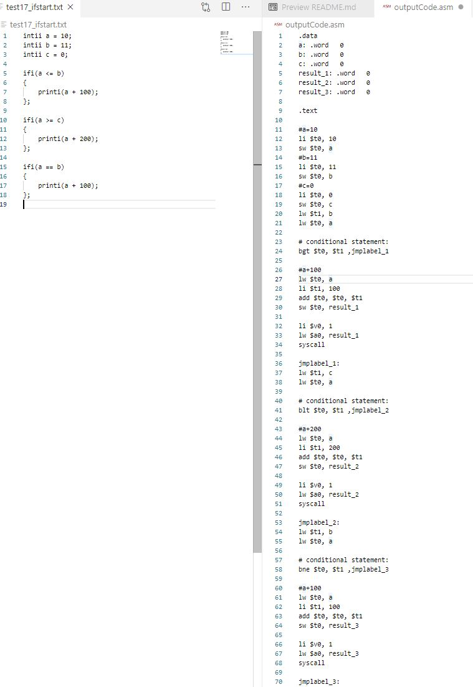

# 1. How to build (compile) __giiCompiler__ ?
    make all (runs a make file)

# 2. How to compile goodii code ?
    ./giiCompiler < goodiiSourceCode.txt

# 3. How to use giiCompiler interactively?
    run:
    ./giiCompiler
    then:
    start typing goodii code in console (e.g "intii a = 0; <ENTER> a = 5 + 3; <ENTER>")

# 4. How to start MARS (Mips Assembler and Runtime Simulator)?

    a) Open terminal and execute following:

    java -jar .\Mars4_5.jar

    b) Open assembler output file generated by giiCompiler 'outputGoodii.asm' 
    c) Run -> Assemble

    